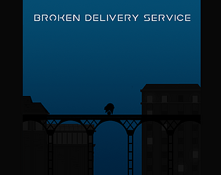

# Broken Delivery Service

Game made for the 2020 GMTK Game Jam with the theme out of control.

I participated in the jam with the Last Minute Team ([@flaviocravero](https://soundcloud.com/flaviocravero) and [@portluc](https://www.deviantart.com/aewron)) we submitted this plataformer where the player doesn't choose when the character will jump.

You can play the game for free in your browser [here](https://theguspassos.itch.io/broken-delivery-service).

### Built with

- Unity 2019.3.15f1

## License

- **[MIT license](http://opensource.org/licenses/mit-license.php)**
